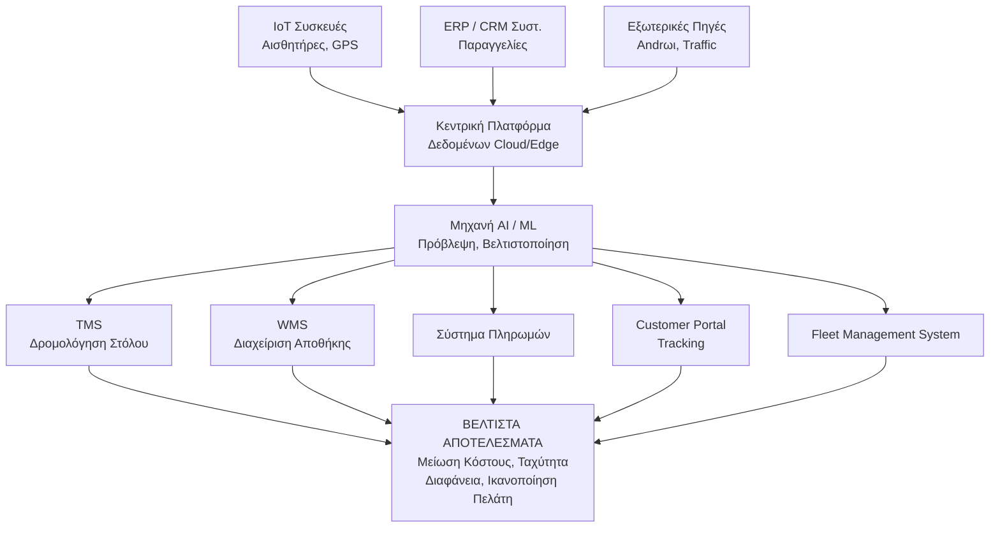
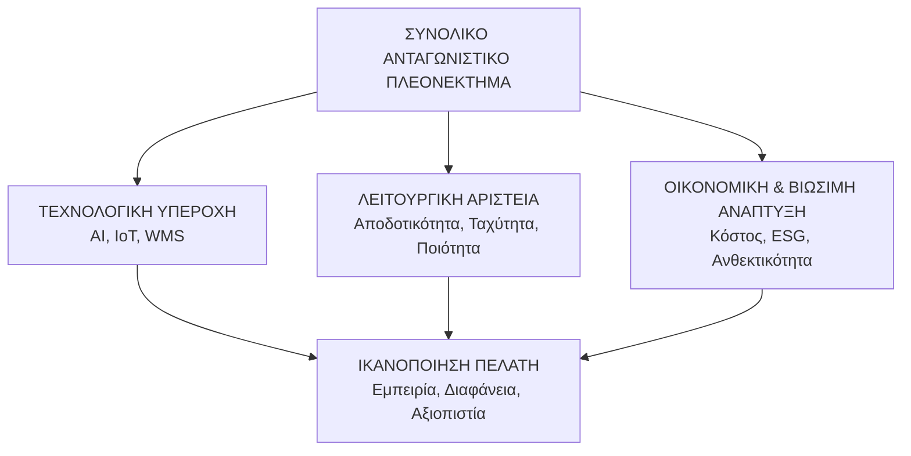

#### **Στρατηγικές και Στόχοι Επιχειρήσεων στον Κλάδο των Logistics**

### **Εισαγωγή: Η Logistics ως Στρατηγικός Πυλώνας της Σύγχρονης Οικονομίας**

Σε έναν παγκοσμιοποιημένο και ενωποιημένο κόσμο, ο κλάδος των logistics δεν αποτελεί πλέον απλώς το "παρασκήνιο" της εμπορικής δραστηριότητας, αλλά τον κεντρικό, νευραλγικό κορμό που την υποστηρίζει. Η διαχείριση της ροής προϊόντων, πληροφοριών και πόρων από το σημείο προέλευσης στο σημείο κατανάλωσης έχει εξελιχθεί σε ένα εξαιρετικά πολύπλοκο και ανταγωνιστικό πεδίο. Οι επιχειρήσεις logistics, από τις γιγαντιαίες εταιρείες 3PL (Third-Party Logistics) μέχρι τις εξειδικευμένες start-ups, αναθεωρούν διαρκώς τις στρατηγικές τους για να ανταποκριθούν σε νέες προκλήσεις και να εκμεταλλευτούν τις ευκαιρίες που προκύπτουν από την τεχνολογική πρόοδο, τις μεταβαλλόμενες καταναλωτικές απαιτήσεις και τις παγκόσμιες γεωπολιτικές συνθήκες.

Αυτή η εργασία, έχει ως στόχο να χαρτογραφήσει το σύγχρονο στρατηγικό τοπίο του κλάδου. Θα αναλύσει τους θεμελιώδεις στόχους που διέπουν τις λειτουργίες των επιχειρήσεων, θα παρουσιάσει τους βασικούς στρατηγικούς πυλώνες για την επίτευξή τους και θα εξετάσει τις κρίσιμες προκλήσεις και τις μελλοντικές τάσεις που διαμορφώνουν το μέλλον των logistics.

---

### **Μέρος 1: Οι Θεμελιώδεις Στόχοι των Σύγχρονων Logistics Εταιρειών**

Κάθε στρατηγική πηγάζει από έναν στόχο. Στον κλάδο των logistics, οι στόχοι είναι πολλαπλοί και αλληλένδετοι και οδηγούν σε μια ισορροπία μεταξύ κόστους, ποιότητας και ταχύτητας.

1.  **Μείωση Κόστους (Cost Reduction):** Παραμένει ένας από τους πιο κρίσιμους στόχους. Περιλαμβάνει τη βελτιστοποίηση του κόστους μεταφοράς (καύσιμα, διόδια), διαχείρισης αποθεμάτων, Warehousing (αποθήκευση) και εργασίας. Οι εταιρείες αναζητούν συνεχώς τρόπους για να εξαλείψουν τις σπατάλες και να βελτιστοποιήσουν τις διαδικασίες.

2.  **Αποδοτικότητα και Παραγωγικότητα (Efficiency & Productivity):** Στόχος είναι η επίτευξη των ίδιων ή καλύτερων αποτελεσμάτων με λιγότερους πόρους. Αυτό μεταφράζεται σε ταχύτερους χρόνους παράδοσης, καλύτερη χρήση του στόλου οχημάτων, αύξηση της παραγωγικότητας στις αποθήκες (π.χ. παραγγελίες ανά ώρα) και μείωση των "νεκρών χρόνων".

3.  **Ικανοποίηση και Εμπειρία Πελάτη (Customer Satisfaction & Experience):** Στην εποχή του e-commerce, ο πελάτης είναι ο βασικός ρυθμιστής. Η ικανοποίηση δεν αφορά μόνο την έγκαιρη παράδοση, αλλά και τη διαφάνεια (real-time tracking), την ευελιξία (επιλογές παραλαβής/παράδοσης), την ακρίβεια και την εξυπηρέτηση μετά την πώληση (π.χ. διαχείριση επιστροφών).

4.  **Ανθεκτικότητα και Ευελιξία (Resilience & Agility):** Η πανδημία COVID-19, οι γεωπολιτικές συγκρούσεις και οι φυσικές καταστροφές έδειξαν πόσο ευάλωτες είναι οι παγκόσμιες εφοδιαστικές αλυσίδες. Οι σύγχρονες επιχειρήσεις στοχεύουν στην οικοδόμηση ανθεκτικών δικτύων που μπορούν να αντέξουν στους κραδασμούς και να προσαρμοστούν γρήγορα σε απρόβλεπτες συνθήκες.

5.  **Βιωσιμότητα και ESG (Sustainability & ESG (Environmental-Social-Governance):** Η περιβαλλοντική, κοινωνική και εταιρική διακυβέρνηση (ESG) δεν είναι πλέον επιλογή, αλλά αναγκαιότητα. Οι στόχοι περιλαμβάνουν τη μείωση του αποτυπώματος άνθρακα, την υιοθέτηση "πράσινων" πρακτικών (π.χ. ηλεκτρικά οχήματα, βελτιστοποιηση συσκευασιών) και την προώθηση μιας κυκλικής οικονομίας μέσω της διαχείρισης επιστροφών (reverse logistics).

---

### **Μέρος 2: Βασικοί Στρατηγικοί Πυλώνες για την Επίτευξη των Στόχων**

Για να υλοποιήσουν τους παραπάνω στόχους, οι επιχειρήσεις logistics υιοθετούν ένα σύνολο αλληλένδετων στρατηγικών.

#### **1. Ψηφιακός Μετασχηματισμός και Τεχνολογία**

Αυτός είναι ο πιο δυναμικός πυλώνας. Η τεχνολογία δεν είναι πλέον εργαλείο, αλλά ο ίδιος ο ορισμός της σύγχρονης logistics.

*   **Συνιστώσες:**
    *   **Τεχνητή Νοημοσύνη (AI) & Machine Learning (ML):** Για πρόβλεψη ζήτησης, βελτιστοποίηση δρομολογίων, διαχείριση αποθεμάτων και προβλεπτική συντήρηση οχημάτων.
    *   **Internet of Things (IoT):** Αισθητήρες σε οχήματα, παλέτες και προϊόντα παρέχουν δεδομένα σε πραγματικό χρόνο για τη θέση, τη θερμοκρασία, την υγρασία και την κατάσταση των εμπορευμάτων.
    *   **Warehouse Management Systems (WMS) & Transportation Management Systems (TMS):** Λογισμικά που αυτοματοποιούν και βελτιστοποιούν τις λειτουργίες της αποθήκης και του μεταφορικού έργου.
    *   **Blockchain:** Προσφέρει ασφάλεια, διαφάνεια και αμεταβλητότητα στις συναλλαγές, ιδανικό για τη διαχείριση συμβολαίων και την ανίχνευση προϊόντων σε πολύπλοκες εφοδιαστικές αλυσίδες.

*   **Διάγραμμα Ροής: Το Οικοσύστημα του Ψηφιακού  Logistics**

##### **2. Βελτιστοποίηση Δικτύου και Υποδομών**

Η φυσική διάταξη του δικτύου μιας εταιρείας logistics είναι κρίσιμη για την αποδοτικότητα.

*   **Συνιστώσες:**
    *   **Σχεδιασμός Δικτύου:** Απόφαση μεταξύ μοντέλων Hub-and-Spoke (κεντρικοί κόμβοι και δορυφόροι) και Point-to-Point (άμεσες συνδέσεις).
    *   **Τοποθεσία Αποθηκών/Distribution Centers (DCs):** Στρατηγική επιλογή θέσεων για ελαχιστοποίηση της απόστασης προς τους τελικούς καταναλωτές, συχνά κοντά σε μεγάλα αστικά κέντρα (Urban Logistics).
    *   **Nearshoring vs. Offshoring:** Η μεταφορά παραγωγής και αποθηκών πιο κοντά στις αγορές-στόχους (nearshoring) για μείωση του κινδύνου και του χρόνου παράδοσης, σε αντίθεση με την παραδοσιακή μεταφορά σε χώρες χαμηλού κόστους (offshoring).

##### **3. Αυτοματισμός και Ρομποτική**

Ο αυτοματισμός μεταμορφώνει τις αποθήκες και τα κέντρα διαλογής, αυξάνοντας δραματικά την παραγωγικότητα και μειώνοντας τα λάθη.

*   **Συνιστώσες:**
    *   **Warehouse Robotics:** Ρομπότ-AGVs (Automated Guided Vehicles) για τη μεταφορά παλετών, ρομπότ-κομιστές (pickers) που φέρνουν τα προϊόντα στον άνθρωπο, και αυτόματα συστήματα συσκευασίας.
    *   **Automated Storage and Retrieval Systems (AS/RS):** Πλήρως αυτοματοποιημένα συστήματα αποθήκευσης και ανάκτησης προϊόντων.
    *   **Automated Sorting Systems:** Συστήματα ταξινόμησης πακέτων υψηλής ταχύτητας που βασίζονται σε barcode scanners και όραση υπολογιστή.

##### **4. Ανθρώπινο Κεφάλαιο και Δεξιότητες**

Η τεχνολογία δεν έχει αξία χωρίς τα κατάλληλα άτομα για να τη διαχειριστούν. Η στρατηγική για το ανθρώπινο δυναμικό είναι ζωτικής σημασίας.

*   **Συνιστώσες:**
    *   **Εκπαίδευση και Upskilling:** Εκπαίδευση των εργαζομένων στη χρήση νέων τεχνολογιών (WMS, data analytics).
    *   **Προσέλκυση Ταλέντων:** Ανάγκη για data scientists, μηχανικούς ρομποτικής και ειδικούς στην εφοδιαστική αλυσίδα.
    *   **Διατήρηση Οδηγών:** Αντιμετώπιση της παγκόσμιας έλλειψης οδηγών μέσω καλύτερων αμοιβών, βελτιωμένων συνθηκών εργασίας και χρήσης τεχνολογίας για την απλοποίηση της εργασίας τους.

##### **5. Βιωσιμότητα και Πράσινη Logistics**

Η περιβαλλοντική συνείδηση πλέον επηρεάζει τις επιλογές των καταναλωτών και των επενδυτών.

*   **Συνιστώσες:**
    *   **Πράσινος Στόλος (Green Fleet):** Επένδυση σε ηλεκτρικά οχήματα (EVs) για τις αστικές μεταφορές και οχήματα που χρησιμοποιούν εναλλακτικά καύσιμα.
    *   **Βελτιστοποίηση Δρομολογίων:** Μείωση των χιλιομέτρων και της κατανάλωσης καυσίμου μέσω λογισμικού.
    *   **Βιώσιμη Συσκευασία:** Χρήση ανακυκλώσιμων υλικών και μείωση του όγκου της συσκευασίας.
    *   **Reverse Logistics:** Αποτελεσματική διαχείριση επιστροφών, επισκευής και ανακύκλωσης προϊόντων για την υποστήριξη της κυκλικής οικονομίας.

---

#### **Μέρος 3: Στατιστικά Δεδομένα και Αγοραστικές Τάσεις**

Για να κατανοήσουμε το μέγεθος της μεταμόρφωσης, μερικά στατιστικά στοιχεία είναι ενδεικτικά:

*   **Μέγεθος Αγοράς:** Η παγκόσμια αγορά logistics εκτιμάται ότι ξεπερνά τα **10 τρισ. δολάρια** και αναμένεται να παρουσιάσει ετήσιο ρυθμό ανάπτυξης (CAGR) άνω του **5-6%** για την επόμενη πενταετία, με κύριο μοχλό την ανάπτυξη του e-commerce.
*   **E-commerce Logistics:** Το **e-commerce αντιπροσωπεύει πλέον πάνω από 20%** του συνόλου των πωλήσεων λιανικής σε πολλές ανεπτυγμένες αγορές, δημιουργώντας τεράστια πίεση για γρήγορες και αξιόπιστες παραδόσεις "την επόμενη ημέρα" ή ακόμα και "την ίδια ημέρα".
*   **Επένδυση σε Τεχνολογία:** Η παγκόσμια αγορά AI στα logistics προβλέπεται να φτάσει τα **15 δισ. δολάρια έως το 2027**, από περίπου 2 δισ. δολάρια το 2022, αντικατοπτρίζοντας την τεράστια στροφή προς τα δεδομένα.
*   **Προκλήσεις Εφοδιαστικής Αλυσίδας:** Σύμφωνα με πρόσφατες έρευνες, πάνω από το **70%** των εταιρειών δήλωσαν ότι βίωσαν σημαντικές διαταραχές στην εφοδιαστική τους αλυσίδα το τελευταίο έτος, κυρίως λόγω γεωπολιτικών εντάσεων και πληθωρισμού.

---

#### **Μέρος 4: Διάγραμμα Συνιστωσών μιας Ολοκληρωμένης Στρατηγικής Logistics**

Μια επιτυχημένη στρατηγική δεν είναι μονοδιάστατη. Είναι ένα σύνολο αλληλένδετων συνιστωσών που στοχεύουν στο συνολικό ανταγωνιστικό πλεονέκτημα.

---

#### **Μέρος 5: Προκλήσεις και το Μέλλον των Logistics**

Παρά τις προηγμένες στρατηγικές, ο κλάδος αντιμετωπίζει σημαντικές προκλήσεις:

*   **Γεωπολιτική Αστάθεια:** Πόλεμοι, εμπορικοί πόλεμοι και προστατευτισμός δημιουργούν απρόβλεπτα εμπόδια και κοστίζουν.
*   **Έλλειψη Εργατικού Δυναμικού:** Η έλλειψη οδηγών και εξειδικευμένου προσωπικού στις αποθήκες είναι μια παγκόσμια κρίση.
*   **Κυβερνοασφάλεια:** Καθώς τα συστήματα γίνονται πιο ψηφιακά, αυξάνεται και ο κίνδυνος κυβερνοεπιθέσεων που μπορούν να παραλύσουν ολόκληρες εφοδιαστικές αλυσίδες.
*   **Πληθωρισμός και Κόστος Ενέργειας:** Η αύξηση του κόστους καυσίμων και ενέργειας ασκεί τεράστια πίεση στα περιθώρια κέρδους.

**Μελλοντικές Τάσεις που θα διαμορφώσουν το αύριο:**

*   **Αυτόνομη Κινητικότητα:** Η χρήση αυτόνομων οχημάτων και drones για παραδόσεις, αρχικά σε ελεγχόμενα περιβάλλοντα (π.χ. αποθήκες, λιμάνια) και σταδιακά σε δημόσιους δρόμους.
*   **Logistics as a Service (LaaS):** Η παροχή logistics ως μια ευέλικτη, συνδρομητική υπηρεσία στο cloud, επιτρέποντας και σε μικρότερες επιχειρήσεις πρόσβαση σε προηγμένες δυνατότητες.
*   **Υπερ-Εξατομίκευση (Hyper-Personalization):** Παραδόσεις σε συγκεκριμένα χρονικά παράθυρα, παραλαβή από σημεία κοντά στον καταναλωτή (pick-up points) και ακόμα και παραδόσεις μέσα στο σπίτι (in-home delivery).
*   **Η Κυριαρχία των Δεδομένων:** Οι εταιρείες που θα μπορέσουν να συλλέξουν, να αναλύσουν και να δράσουν βάσει δεδομένων σε πραγματικό χρόνο θα είναι οι νικητές.

---

**Συμπέρασμα**
Ο κλάδος των logistics βρίσκεται σε μια εποχή επαναπροσδιορισμού. Από ένα παραδοσιακά λειτουργικό και κόστους-κεντρικό πεδίο, μετατρέπεται σε έναν στρατηγικό, τεχνολογικά αιχμηρό και πελατοκεντρικό τομέα. Οι επιχειρήσεις που επιθυμούν να ευδοκιμήσουν στο μέλλον πρέπει να υιοθετήσουν μια ολιστική προσέγγιση, συνδυάζοντας τον ψηφιακό μετασχηματισμό, την καινοτομία στις διαδικασίες, τη στρατηγική διαχείριση του δικτύου, την επένδυση στο ανθρώπινο δυναμικό και μια αδιαπραγμάτευτη δέσμευση στη βιωσιμότητα. Η ανθεκτικότητα, η ευελιξία και η ικανότητα προσαρμογής δεν είναι πλέον απλώς επιθυμητά χαρακτηριστικά, αλλά προαπαιτούμενα για την επιβίωση και την ανάπτυξη στο δυναμικό τοπίο του 21ου αιώνα.

**Βιβλία / Θεμελιώδη Συγγράμματα**
- Christopher, M. (2016). Logistics & Supply Chain Management (5th ed.). Pearson.

**Επιστημονικά Άρθρα (Διεθνή)**
- Ivanov, D., Dolgui, A., & Sokolov, B. (2019). The ripple effect in supply chains: an overview, framework, and future research. International Journal of Production Research, 57(13), 4375-4401.

- Sarkis, J., Zhu, Q., & Lai, K. H. (2011). An organizational theoretic review of green supply chain management literature. International Journal of Production Economics, 130(1), 1-15.

- Wamba, S. F., & Akter, S. (2019). Big data analytics and firm performance: Effects of dynamic capabilities. Journal of Business Research, 98, 191-203.

**Εκθέσεις & Αναλύσεις Κλάδου**
- McKinsey & Company (2023). The state of logistics: Outpacing the storm, navigating the new normal.

- Deloitte (2023). 2023 Supply Chain Trends: Resilience, Sustainability, and Digital.

**Ελληνικές Πηγές**
- Σύνδεσμος Επιχειρήσεων Logistics (ΣΕΕ) (2023). Ετήσια Έκθεση για τον Κλάδο των Logistics στην Ελλάδα 2022-2023. Αθήνα: ΣΕΕ.

- *Γεωργόπουλος, Α., & Μυλωνάς, Χ. (2021). Ψηφιακός μετασχηματισμός και ανταγωνιστικότητα στις ελληνικές επιχειρήσεις logistics. Ελληνική Επιθεώρηση Διοίκησης Επιχειρήσεων, (87), 45-62.*

